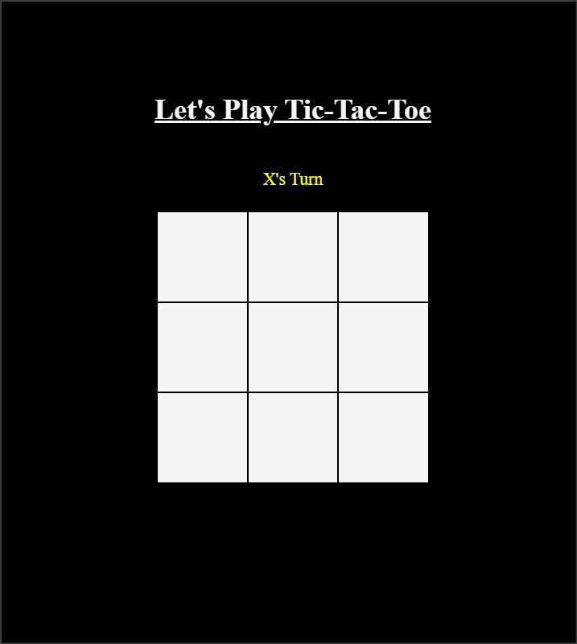
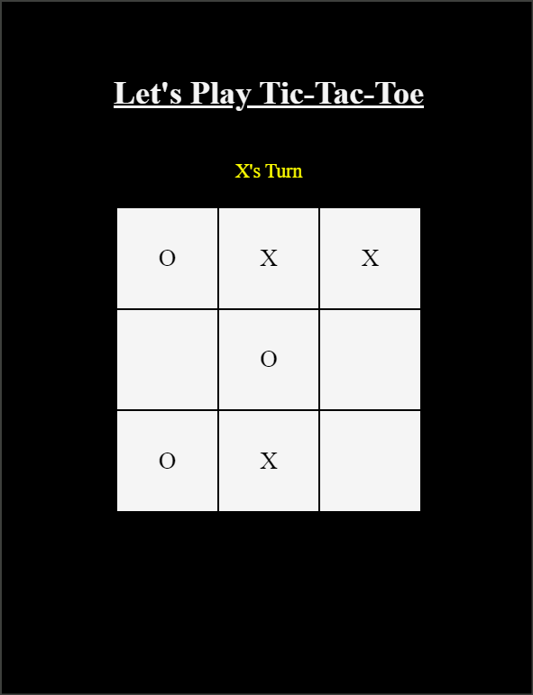
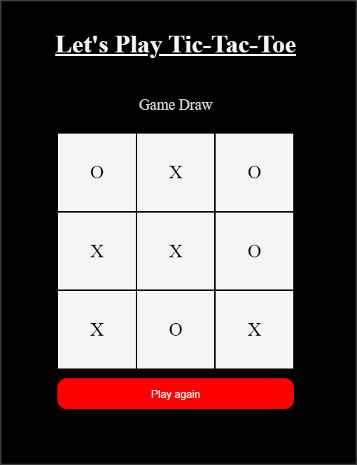

Overview:

This project is a simple implementation of the classic Tic Tac Toe game using HTML, CSS, and JavaScript. It allows two players to play the game on a 3x3 grid, with winning conditions for both players as well as a draw condition.

Features:

- Two-player game
- Interactive user interface
- Winning conditions for 'X' and 'O'
- Draw condition
- Reset game functionality

Technologies Used:

- HTML: Structure of the game
- CSS: Styling of the game elements
- JavaScript: Game logic and interactivity

Screenshots:

Setup:

1. clone the repository using "git clone https://github.com/your-username/tic-tac-toe.git"

2. Navigate to the project directory
cd tic-tac-toe

3. Open the index.html file in your preferred web browser.